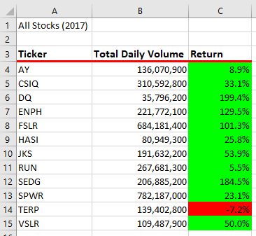
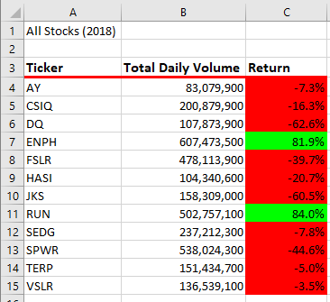
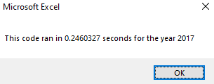
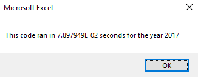
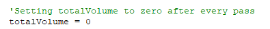
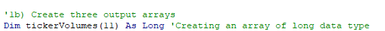

# Stock Analysis

## <u> An Overview of the project </u>
Analysis on stock data to help Steve and his parents determine whether investing in the stock 'DQ' was the right choice or to determine any better alternatives. 
To achieve this goal, we look into the 2017 & 2018 stock databases. Using VBA, we will pull and clean all the necessary data that will be used for our analysis.

## <u> Results </u>
Running our date through the code written in VBA, we can come to a few conclussions:
* Running the 2017 database through our code, intitially you may think investing in DQ may be a good option as it yeilded the highest return percentage. However, Looking at the volume at which it was traded, it came in last with the least volume traded. This helps indicate whether a stock's prices will continue to surge. This is later confirmed in the analysis for 2018 database as it yielded the worst return percentage and least volume traded. In conclusion, DQ is not a great stock in invest in long time.
* The optimal stock to invest in that produces the greatest chances of success is ENPH. This is best shown in our analysis as both years, it yields relatively high percentage returns and maintains a very high trade volume!

Looking at the original code vs the refractor coder we can see a few differences:
* The main differences between the code is the efficiency at which it runs. The refactored code runs faster the original one. As we can, in the images below, the refractored run time is relatively signficantly faster than the original code.
* The difference in time can be attributed to the efficient use of arrays. Using arrays may have helped with this result as it reduces the need of reassigning variables constantly as we just add information to an array.

### 2017 Database Analysis

### 2018 Database Analysis

### Original code runtime

### Refactored code runtime

### Original code

Here we can see that we had to reassign volume every pass

### Original code

Here we can see we added the index volume to an array instead

## <u> Summary </u>
In summary, refactoring our code, we have determined a better stock to invest in and created a more efficient code. Refactoring can prove as an advantage in the coding process as looking back at our code with fresh eyes can help us improve the efficienct of our code.
This is best seen in our original VBA script as not only did it provide a more efficient run time, but it also provided a more concise code which produced the same results.
